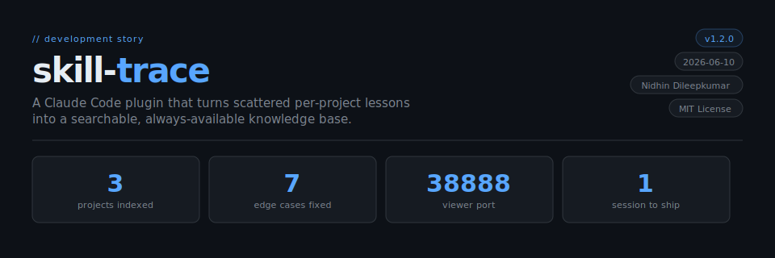
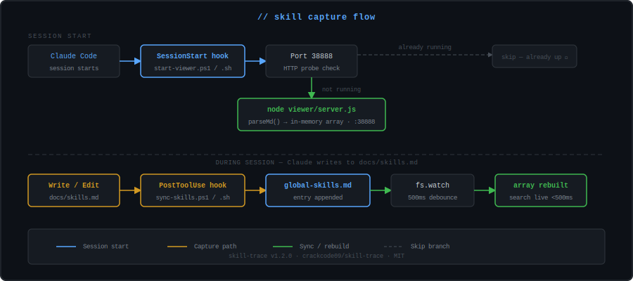
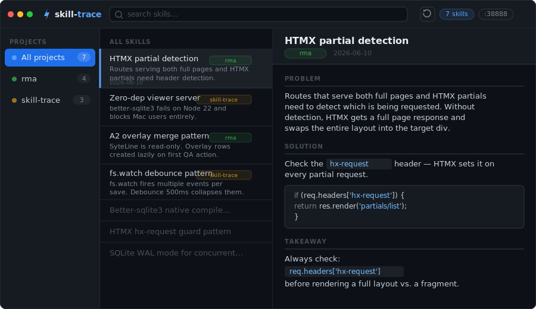

<div align="center">



</div>

---

## `// the problem`

Claude Code developers write valuable lessons into `docs/skills.md` files — but those entries stay **siloed per project**. When starting a new project or hitting a problem you've solved before, there's no way to search across all your accumulated knowledge. Lessons written in one project are invisible when working in another.

## `// the solution`

A **SessionStart hook** automatically launches a local web server on port `38888`. On startup, it parses `~/.claude/global-skills.md` into an **in-memory search index**. A **PostToolUse hook** syncs new entries from any project into that global file the moment you write them.

The viewer is already running before the first keystroke of the session — zero friction.

---

## `// architecture`

```
Claude Code session starts
      │
      ▼
SessionStart hook → start-viewer.ps1 / start-viewer.sh
      │
      ├── Port 38888 occupied + HTTP probe passes → skip (already running)
      │
      └── node viewer/server.js
              │
              ├── parseMd()  →  ~/.claude/global-skills.md  →  in-memory array
              ├── fs.watch   →  auto-resync on file change (500ms debounce)
              ├── PID file   →  ~/.claude/global-skills.pid
              └── :38888
                      ├── GET /             →  3-column viewer UI
                      ├── GET /api/skills   →  substring search across all fields
                      └── POST /api/sync    →  manual re-parse

On any Write/Edit to docs/skills.md:
PostToolUse hook → sync-skills.ps1 (Windows)  ┐
                 → sync-skills.sh  (mac/Linux) ┘→ append to global-skills.md
                                                  → fs.watch picks up change → array resyncs
```

---

## `// capture flow`

<div align="center">



</div>

---

## `// install`

**Option A — Claude Code plugin install (recommended)**

```
/plugin marketplace add crackcode09/skill-trace
/plugin install skill-trace@skill-trace
```

Hooks are configured automatically. Start a new session and the viewer is running.

**Option B — Manual clone**

```bash
# Windows
git clone https://github.com/crackcode09/skill-trace "$env:USERPROFILE\.claude\skills\skill-trace"

# macOS / Linux
git clone https://github.com/crackcode09/skill-trace ~/.claude/skills/skill-trace
```

**2. Add the hooks to `~/.claude/settings.json`** (manual install only)

**Windows** — replace `YOUR_NAME` with your Windows username:

```json
{
  "hooks": {
    "PostToolUse": [
      {
        "matcher": "Write|Edit",
        "hooks": [{
          "type": "command",
          "command": "powershell -ExecutionPolicy Bypass -NonInteractive -File \"C:\\Users\\YOUR_NAME\\.claude\\skills\\skill-trace\\hooks\\scripts\\sync-skills.ps1\"",
          "timeout": 15
        }]
      }
    ],
    "SessionStart": [
      {
        "matcher": "startup",
        "hooks": [{
          "type": "command",
          "command": "powershell -ExecutionPolicy Bypass -NonInteractive -WindowStyle Hidden -File \"C:\\Users\\YOUR_NAME\\.claude\\skills\\skill-trace\\hooks\\scripts\\start-viewer.ps1\"",
          "timeout": 30
        }]
      }
    ]
  }
}
```

**macOS / Linux** — replace `YOUR_NAME` with your username:

```json
{
  "hooks": {
    "PostToolUse": [
      {
        "matcher": "Write|Edit",
        "hooks": [{
          "type": "command",
          "command": "bash \"/home/YOUR_NAME/.claude/skills/skill-trace/hooks/scripts/sync-skills.sh\"",
          "timeout": 15
        }]
      }
    ],
    "SessionStart": [
      {
        "matcher": "startup",
        "hooks": [{
          "type": "command",
          "command": "bash \"/home/YOUR_NAME/.claude/skills/skill-trace/hooks/scripts/start-viewer.sh\"",
          "timeout": 30
        }]
      }
    ]
  }
}
```

> On macOS use `~` or `/Users/YOUR_NAME` instead of `/home/YOUR_NAME`.

**3. Start a new Claude Code session**

The viewer starts automatically. Open `http://localhost:38888` to confirm.

---

## `// usage`

Add entries to `docs/skills.md` in any project:

```markdown
## 2026-06-10 — HTMX partial detection

**Problem:** Routes that serve both full pages and HTMX partials need to
detect which is being requested.

**Solution:** Check the `hx-request` header — HTMX sets it on every
partial request.

**Takeaway:** Always check `req.headers['hx-request']` before rendering
a full layout vs. a fragment.
```

The PostToolUse hook fires on every save, appends to `~/.claude/global-skills.md`, and the viewer resyncs within 500ms. Open `http://localhost:38888` in a browser to search.

---

## `// viewer`

<div align="center">



</div>

Search across title, problem, solution, and takeaway. Filter by project. Click any entry for the full detail pane.

---

## `// tech stack`

| Layer | Technology | Detail |
|-------|-----------|--------|
| Server | Node.js built-ins only | `http`, `fs`, `path`, `os` — zero npm dependencies |
| Search | In-memory `Array.filter()` | Substring match, fast enough for < 1000 entries |
| UI | Vanilla JS + CSS | Single HTML file, no framework, no build step |
| Live sync | `fs.watch` + 500ms debounce | Auto-resyncs when `global-skills.md` changes |
| Hooks | PowerShell + Bash | Windows: `.ps1` · macOS/Linux: `.sh` |
| Storage | Flat Markdown | `~/.claude/global-skills.md` — readable without the app |

---

## `// key decisions`

<details>
<summary><strong>D1 — Flat MD as canonical source, not a database</strong></summary>
<br>
The MD file is readable without the app. The in-memory index is always rebuildable from it. Source of truth is never a binary file.
<br><br>
</details>

<details>
<summary><strong>D2 — Zero npm dependencies</strong></summary>
<br>
v1.1.0 used <code>better-sqlite3</code> with FTS5 — but native binary compilation failed on Node 22 and blocked Mac users entirely. v1.2.0 dropped SQLite completely. <code>Array.filter()</code> over an in-memory JS array is sufficient for &lt; 1000 entries and works on every platform without a build step.
<br><br>
</details>

<details>
<summary><strong>D3 — Fixed port 38888</strong></summary>
<br>
Single-user dev machine. A fixed port means a fixed URL you can bookmark. Dynamic ports would require port discovery on every session start.
<br><br>
</details>

<details>
<summary><strong>D4 — HTTP probe before skipping start</strong></summary>
<br>
<code>netstat</code> shows TIME_WAIT connections that look occupied but aren't. Probing <code>/api/skills</code> confirms it's actually our server — not a leftover socket from a crashed process.
<br><br>
</details>

<details>
<summary><strong>D5 — Viewer ships first, in-session injection later</strong></summary>
<br>
The viewer proves value before investing in the harder PreToolUse context-injection feature. Get community usage data before building deeper.
<br><br>
</details>

---

## `// known limitations`

- **Append-only sync** — entries are deduplicated by header + project name. If you rename an entry's title or fix a typo in its date, a duplicate appears in `global-skills.md`. Body edits (problem/solution/takeaway text) never propagate to the global file. To correct an entry, edit it directly in `~/.claude/global-skills.md`.
- **Pure Windows without Git Bash** — the bash hooks (`sync-skills.sh`, `start-viewer.sh`) require bash. On a machine with only PowerShell and no Git Bash installed, use the Windows-only manual hooks snippet in the install section above.
- **< 1000 entries** — the in-memory `Array.filter()` search is fast up to roughly 1000 entries. Beyond that, consider the v1.3.0 BM25 scorer (see roadmap).

---

## `// roadmap`

| Version | Feature | Status |
|---------|---------|--------|
| v1.2.0 | Zero-dep server, Mac/Linux support, skill-trace rename | ✅ shipped |
| v1.3.0 | PreToolUse hook — auto-inject relevant skills into Claude's context | planned |
| v2.0.0 | Team sync — shared repo or API backend, multi-developer | planned |

---

## `// files`

```
skill-trace/
├── viewer/
│   ├── server.js          # Node.js HTTP server (port 38888) — zero deps
│   ├── package.json       # dependencies: {}
│   └── public/
│       └── index.html     # 3-column viewer UI
├── hooks/
│   ├── hooks.json
│   └── scripts/
│       ├── sync-skills.ps1    # PostToolUse: Windows — append to global-skills.md
│       ├── sync-skills.sh     # PostToolUse: macOS/Linux — append to global-skills.md
│       ├── start-viewer.ps1   # SessionStart: Windows viewer startup
│       └── start-viewer.sh    # SessionStart: macOS/Linux viewer startup
├── skills/
│   └── gskills/
│       └── SKILL.md           # /gskills slash command — search global skills log
├── .claude-plugin/
│   └── plugin.json
├── LICENSE
├── CHANGELOG.md
└── README.md
```

---

## `// contributing`

The codebase is intentionally simple — `viewer/server.js` is ~110 lines with no dependencies. A new contributor can read the whole server in 5 minutes.

1. Fork the repo
2. Add your entry format support, search improvements, or platform-specific hook scripts
3. Test: `node viewer/server.js` — verify `GET /api/skills` returns entries
4. Open a PR

---

## `// license`

MIT — see [LICENSE](LICENSE)

---

<div align="center">

```
skill-trace v1.2.0 · 2026-06-10 · MIT
```

</div>
