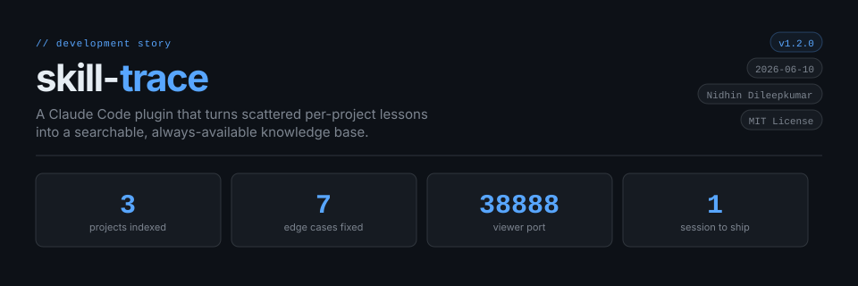
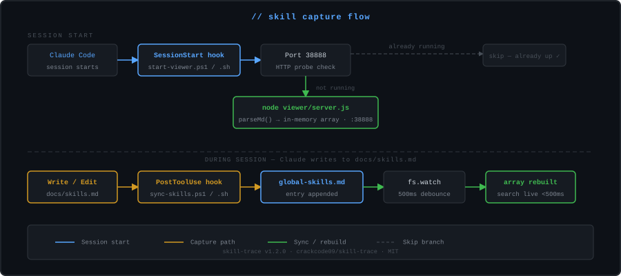
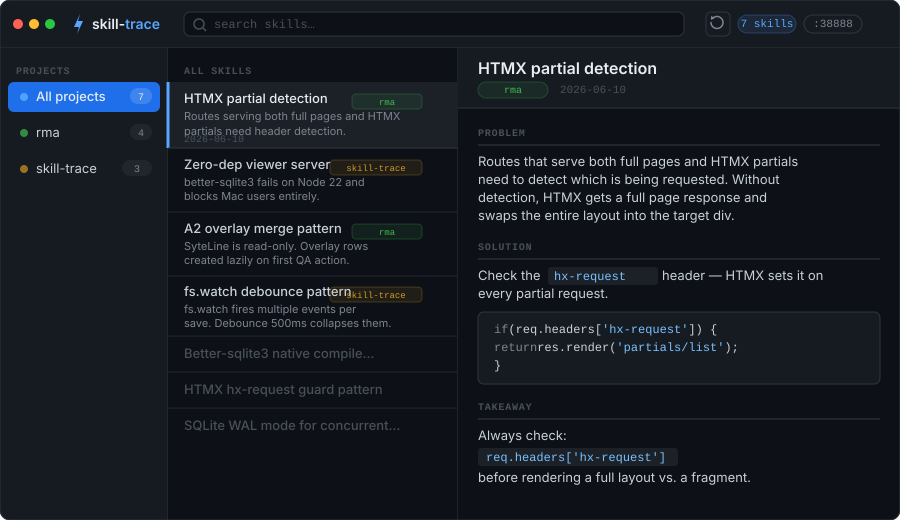

<div align="center">



**claude-mem remembers what Claude did. skill-trace remembers what you learned.**

*A curated lessons-learned log for Claude Code — Problem / Solution / Takeaway, one grep-able markdown file, zero dependencies.*

</div>

---

## `// the problem`

Claude Code developers learn valuable lessons inside projects — but those lessons stay **siloed per project**. When starting a new project or hitting a problem you've solved before, there's no way to search across all your accumulated knowledge. Lessons learned in one project are invisible when working in another.

## `// the solution`

Every lesson is **one small markdown file with a typed header** (id, date, Stack tags, provenance, a content hash), kept in a store inside the project at `.claude/skill-trace/` — so it travels with the repo, like shared agents and skills. Projects you mark as **trusted** sync their lessons into a global store at `~/.claude/skill-trace/`.

A **SessionStart hook** launches a local viewer on port `38888` that reads the global store into an **in-memory search index**. A **PostToolUse hook** keeps the stores in step the moment you save. A generated `global-skills.md` rollup stays beside the store for grep.

The viewer is already running before the first keystroke of the session — zero friction.

---

## `// architecture`

```
Claude Code session starts
      │
      ▼
SessionStart hook → start-viewer.ps1 / start-viewer.sh
      │
      ├── Port 38888 occupied + HTTP probe passes → skip (already running)
      │
      └── node viewer/server.js
              │
              ├── loadStore()  →  ~/.claude/skill-trace/lessons/*.md  →  in-memory array
              ├── first run    →  migrates a legacy global-skills.md into the store
              ├── fs.watch     →  auto-resync when the store changes (500ms debounce)
              ├── PID file     →  ~/.claude/global-skills.pid
              └── :38888
                      ├── GET    /                 →  viewer UI (list + dashboard)
                      ├── GET    /api/skills       →  substring search across all fields
                      ├── GET    /api/lessons/:id  →  one lesson
                      ├── DELETE /api/lessons/:id  →  delete (tombstoned)
                      └── POST   /api/sync         →  re-read the store

On any save of a lesson (log-lesson, or a Write/Edit to a lesson file or docs/skills.md):
PostToolUse hook → sync-skills.ps1 / .sh → node viewer/store.js hook
    → lesson lands in <project>/.claude/skill-trace/lessons/
    → project trusted?  yes → mirrored into ~/.claude/skill-trace/  → viewer resyncs
                        no  → stays in the project; source recorded for /skill-trust
```

---

## `// capture flow`

<div align="center">



</div>

---

## `// install`

**Option A — Claude Code plugin install (recommended)**

```
/plugin marketplace add crackcode09/skill-trace
/plugin install skill-trace@skill-trace
```

Hooks are configured automatically. Start a new session and the viewer is running.

**Option B — Manual clone**

```bash
# Windows
git clone https://github.com/crackcode09/skill-trace "$env:USERPROFILE\.claude\skills\skill-trace"

# macOS / Linux
git clone https://github.com/crackcode09/skill-trace ~/.claude/skills/skill-trace
```

**2. Add the hooks to `~/.claude/settings.json`** (manual install only)

**Windows** — replace `YOUR_NAME` with your Windows username:

```json
{
  "hooks": {
    "PostToolUse": [
      {
        "matcher": "Write|Edit",
        "hooks": [{
          "type": "command",
          "command": "powershell -ExecutionPolicy Bypass -NonInteractive -File \"C:\\Users\\YOUR_NAME\\.claude\\skills\\skill-trace\\hooks\\scripts\\sync-skills.ps1\"",
          "timeout": 15
        }]
      }
    ],
    "SessionStart": [
      {
        "matcher": "startup",
        "hooks": [{
          "type": "command",
          "command": "powershell -ExecutionPolicy Bypass -NonInteractive -WindowStyle Hidden -File \"C:\\Users\\YOUR_NAME\\.claude\\skills\\skill-trace\\hooks\\scripts\\start-viewer.ps1\"",
          "timeout": 30
        }]
      }
    ]
  }
}
```

**macOS / Linux** — replace `YOUR_NAME` with your username:

```json
{
  "hooks": {
    "PostToolUse": [
      {
        "matcher": "Write|Edit",
        "hooks": [{
          "type": "command",
          "command": "bash \"/home/YOUR_NAME/.claude/skills/skill-trace/hooks/scripts/sync-skills.sh\"",
          "timeout": 15
        }]
      }
    ],
    "SessionStart": [
      {
        "matcher": "startup",
        "hooks": [{
          "type": "command",
          "command": "bash \"/home/YOUR_NAME/.claude/skills/skill-trace/hooks/scripts/start-viewer.sh\"",
          "timeout": 30
        }]
      }
    ]
  }
}
```

> On macOS use `~` or `/Users/YOUR_NAME` instead of `/home/YOUR_NAME`.

**3. Start a new Claude Code session**

The viewer starts automatically. Open `http://localhost:38888` to confirm.

---

## `// usage`

You rarely write a lesson by hand — say *"log that"* and the **`log-lesson` skill** (below) does it. Each lesson becomes a file like this in the project's store:

```markdown
---
id: 01J9Q3KXW7M2A8R5V6T0ZB4HNE
type: Lesson
schema: 2
title: HTMX partial detection
date: 2026-06-10
stack: [html, http]
projects: [my-app]
seen: 1
generated_by: claude-code
created: 2026-06-10T14:02:11Z
updated: 2026-06-10T14:02:11Z
hash: 7f3a9c1e4b2d
---
**Problem:** Routes that serve both full pages and HTMX partials need to
detect which is being requested.

**Solution:** Check the `hx-request` header — HTMX sets it on every
partial request.

**Takeaway:** Always check `req.headers['hx-request']` before rendering
a full layout vs. a fragment.
```

The file is yours: edit it, `git diff` it, delete it. A hand edit is noticed (the hash no longer matches, the viewer says so) and re-blessed on the next save. If the project is trusted, the global store mirrors it and the viewer at `http://localhost:38888` resyncs within 500ms.

> **Have a `docs/skills.md` from before?** It is migrated into the store the first time a lesson is saved there: split into files, renamed to `skills.legacy-<date>.md`, and regenerated as a read-only rollup so grep keeps working. New projects get no `docs/` folder. Set `SKILL_TRACE_SOURCE_PATTERN` (a regex) to treat another markdown file the same way.

---

## `// skills & commands`

The plugin adds two skills and two slash commands to Claude Code. Skills are invoked by Claude automatically when your request matches their description; you can also trigger one explicitly by name.

### `log-lesson` — capture a lesson *(skill)*

Captures **one** genuinely reusable, non-obvious lesson into the current project's store (`.claude/skill-trace/lessons/`). This is what makes the log fill itself — you never maintain lesson files by hand.

- **Fires** when you say *"log that"*, *"log this lesson"*, *"save this to skills"*, or when Claude is wrapping up a session in which a lesson worth keeping emerged.
- **Selective by design.** It logs only the single most transferable lesson (hard cap 2/session) and skips routine fixes, task summaries, and project-specific facts. Most sessions log nothing — that's correct.
- **Verified at write time.** The in-session confirmation *is* the review: there is no draft state and no second approval pass. A lesson in the store is one you agreed to keep; delete or rewrite it any time.
- **Safe by design.** It refuses to log secrets or real data. The lesson always lands in the project; it reaches the global store only if the project is **trusted** (see `/skill-trust`) — otherwise Claude tells you it stayed local and how to grant trust. New Stack tags are confirmed with you before being added to the vocabulary.

```text
You: "that lock bug was nasty — log what we learned"
Claude: → log-lesson → writes .claude/skill-trace/lessons/2026-06-12-lock-every-file--…md
```

### `/gskills [query]` — search the global log *(skill)*

Search every lesson you've ever logged, across all projects.

```text
/gskills                 # list all entries, most recent first
/gskills powershell      # entries matching "powershell" (substring, all fields)
```

Also fires on phrasings like *"what do I know about X"* or *"search my skills log"*. (Requires the viewer running on port 38888 — it is, via the SessionStart hook.)

### `/skill-trust [grant|revoke|list] [slug]` — choose which projects go global *(command)*

Every project keeps its own lessons. Only **trusted** projects sync into the global store (and, later, into context injection). The sync hook records every new source as `trusted=no`; trust is granted only by you, never inferred from anything inside a lessons file. Granting syncs that project's existing lessons immediately; revoking stops future syncs and keeps what was already accepted.

```text
/skill-trust list                # show the registry
/skill-trust grant my-project    # trust a source (no -> yes) — syncs it now
/skill-trust revoke my-project   # untrust it (yes -> no)
```

### `/skill-trace [forget|sync|status]` — manage this project's store *(command)*

```text
/skill-trace status              # lessons, slug, trusted?, hand-edited, recurring
/skill-trace forget lock         # delete the one lesson whose title matches "lock" (refuses if ambiguous)
/skill-trace sync                # run the sync by hand (the hook normally does this on save)
```

Deleting from the **global** store is done in the viewer (Delete on any entry). Deleted lessons are tombstoned so a re-sync cannot bring them back.

---

## `// viewer`

<div align="center">



</div>

Search across title, problem, solution, takeaway, Stack tags and project names — the count inside the search box tells you how many of your lessons match. Filter by project from the rail, or switch to the **Dashboard** to see lessons grouped by Stack tag and drill into one; the filter strip under the top bar shows what is narrowing the list and clears it. Every entry opens with a **Metadata** panel showing its file header exactly as on disk, `seen ×N` for recurring lessons, a flag if it was edited by hand, and a Delete action.

---

## `// vs claude-mem`

[claude-mem](https://github.com/thedotmack/claude-mem) is an automatic observation recorder — it captures every tool call, compresses them with AI, and stores them in SQLite + Chroma vector embeddings. It answers *"what was I doing last session?"*

skill-trace is a curated lessons journal. You (or Claude, on instruction) choose what's worth keeping. It answers *"what did I learn, ever, anywhere?"*

| | skill-trace | claude-mem |
| -- | -- | -- |
| **Capture** | Manual — you choose what matters | Automatic — every tool call, compressed |
| **Signal** | Distilled: Problem / Solution / Takeaway | Exhaust: full observation stream |
| **Storage** | One markdown file per lesson, typed header — grep it, vim it, git it | SQLite + Chroma vector DB |
| **Dependencies** | Zero — Node built-ins only | Node 20+, Bun, Python + uv embedding service |
| **Answers** | "What did I learn, ever, anywhere?" | "What was I doing last session?" |
| **Readable without the app** | Yes — plain `.md` file | No — requires the service to query |

**Both tools can coexist.** If you want automatic total recall of every action, use claude-mem. If you want a curated engineering logbook that travels with your repos and across machines as plain files, use skill-trace.

---

## `// tech stack`

| Layer | Technology | Detail |
|-------|-----------|--------|
| Server | Node.js built-ins only | `http`, `fs`, `path`, `os` — zero npm dependencies |
| Search | In-memory `Array.filter()` | Substring match, fast enough for < 1000 entries |
| UI | Vanilla JS + CSS | Single HTML file, no framework, no build step |
| Live sync | `fs.watch` + 500ms debounce | Auto-resyncs when the store changes |
| Hooks | PowerShell + Bash shims → Node | Windows: `.ps1` · macOS/Linux: `.sh` — each a one-line call into `viewer/store.js` |
| Storage | One markdown file per lesson | `.claude/skill-trace/lessons/` (project) · `~/.claude/skill-trace/lessons/` (global) — readable without the app |
| Identity | ULID + body hash | Dedup by id → hash → same title within 7 days; hand edits detected by hash |

---

## `// key decisions`

<details>
<summary><strong>D1 — Plain text as canonical source, not a database</strong></summary>
<br>
The lesson files are readable without the app. The in-memory index is always rebuildable from them. Source of truth is never a binary file.
<br><br>
</details>

<details>
<summary><strong>D6 — One file per lesson, with a typed header (v1.4.0)</strong></summary>
<br>
A single appended file was fragile: a typo in a header dropped an entry, retitling duplicated it, body edits never propagated, and nothing told a tool-written lesson from a pasted one. One file per lesson with an id, timestamps and a body hash fixes all four, makes diffs and merges clean when a project store is shared through git, and gives context injection typed fields to score. A database would not have helped — a SQLite file is as editable as markdown, it only <em>feels</em> safer; what matters is a single write path plus a schema, which plain files can have too. Grep-ability is kept by regenerating the old single file from the store, but <strong>only where it already existed</strong>: skill-trace never creates a <code>docs/</code> folder in a project on its own.
<br><br>
</details>

<details>
<summary><strong>D2 — Zero npm dependencies</strong></summary>
<br>
v1.1.0 used <code>better-sqlite3</code> with FTS5 — but native binary compilation failed on Node 22 and blocked Mac users entirely. v1.2.0 dropped SQLite completely. <code>Array.filter()</code> over an in-memory JS array is sufficient for &lt; 1000 entries and works on every platform without a build step.
<br><br>
</details>

<details>
<summary><strong>D3 — Fixed port 38888</strong></summary>
<br>
Single-user dev machine. A fixed port means a fixed URL you can bookmark. Dynamic ports would require port discovery on every session start.
<br><br>
</details>

<details>
<summary><strong>D4 — HTTP probe before skipping start</strong></summary>
<br>
<code>netstat</code> shows TIME_WAIT connections that look occupied but aren't. Probing <code>/api/skills</code> confirms it's actually our server — not a leftover socket from a crashed process.
<br><br>
</details>

<details>
<summary><strong>D5 — Viewer ships first, in-session injection later</strong></summary>
<br>
The viewer proves value before investing in the harder PreToolUse context-injection feature. Get community usage data before building deeper.
<br><br>
</details>

---

## `// known limitations`

- **The project copy is the author.** For a lesson that came from a project, the global mirror follows the project file. Editing the global copy of such a lesson is overwritten on that project's next save; edit it in the project instead. Lessons that exist only globally (migrated from an old single file) have no project and can be edited in place.
- **Delete is per store.** Deleting in the viewer removes the global copy and tombstones it; the originating project keeps its file until you `/skill-trace forget` it there. This is deliberate — a lesson may have several sources.
- **Node is required for the hooks.** The sync hook is a one-line shim into `viewer/store.js`, so `node` must be on the PATH of the shell Claude Code runs hooks in (the viewer already needed it). `SKILL_TRACE_NODE` overrides the executable.
- **Pure Windows without Git Bash** — the bash hooks (`sync-skills.sh`, `start-viewer.sh`) require bash. On a machine with only PowerShell and no Git Bash installed, use the Windows-only manual hooks snippet in the install section above.
- **< 1000 entries** — the in-memory `Array.filter()` search is fast up to roughly 1000 entries. Beyond that, a ranked scorer is the obvious next step.

---

## `// roadmap`

| Version | Feature | Status |
|---------|---------|--------|
| v1.2.0 | Zero-dep server, Mac/Linux support, skill-trace rename | ✅ shipped |
| v1.3.0 | `log-lesson` skill, trust registry, Stack tags + dashboard, viewer navigation & search overhaul, test suite + 3-OS CI | ✅ shipped |
| v1.4.0 | One file per lesson with typed header, project + global stores, trust-gated sync, delete/rewrite, Metadata panel, `/skill-trace` | ✅ shipped |
| v1.5.0 | PreToolUse hook — auto-inject relevant lessons into Claude's context, scored on Stack tags | planned |
| v2.0.0 | Team sync — project stores already travel with the repo; shared global via a repo or API backend | planned |

---

## `// files`

```
skill-trace/
├── viewer/
│   ├── store.js           # the lesson store: format, ids, dedup, sync, migrate — zero deps; also the hook/CLI
│   ├── server.js          # Node.js HTTP server (port 38888) — reads the global store
│   ├── trust.js           # source-trust registry CLI (grant/revoke/list)
│   ├── package.json       # dependencies: {}
│   ├── public/
│   │   └── index.html     # viewer UI: list, dashboard, metadata panel
│   └── test/              # node:test suite (store, sync, hooks runtime, server e2e, trust)
├── hooks/
│   ├── hooks.json
│   └── scripts/
│       ├── sync-skills.ps1    # PostToolUse: Windows — one call into store.js hook
│       ├── sync-skills.sh     # PostToolUse: macOS/Linux — one call into store.js hook
│       ├── start-viewer.ps1   # SessionStart: Windows viewer startup
│       └── start-viewer.sh    # SessionStart: macOS/Linux viewer startup
├── skills/
│   ├── gskills/
│   │   └── SKILL.md           # /gskills — search the global store
│   └── log-lesson/
│       └── SKILL.md           # capture one reusable lesson → the project store
├── commands/
│   ├── skill-trust.md         # /skill-trust — which projects sync globally
│   └── skill-trace.md         # /skill-trace — forget | sync | status for this project
├── demo/                      # fictional lessons + `npm run demo` launcher
├── docs/
│   ├── FORMAT.md              # lesson file format (schema 2), stores, rollups, Stack vocabulary
│   └── TRUST.md               # trust model
├── assets/
│   └── icon.svg               # canonical brand mark (logo + favicon source)
├── .claude-plugin/
│   └── plugin.json
├── LICENSE
├── CHANGELOG.md
└── README.md
```

---

## `// contributing`

The codebase is intentionally simple and has no dependencies: `viewer/store.js` owns the format and every store operation, `viewer/server.js` serves it, `viewer/public/index.html` shows it. Everything is covered by a `node:test` suite that runs on ubuntu, windows and macos in CI.

1. Fork the repo and branch from `dev`
2. `npm test` from the root; `npm run demo` for a throwaway viewer on fictional lessons
3. Open a PR against `dev` — CI must be green on all three OSes

---

## `// license`

MIT — see [LICENSE](LICENSE)

---

<div align="center">

```
skill-trace v1.4.0 · 2026-10-02 · MIT
```

</div>
